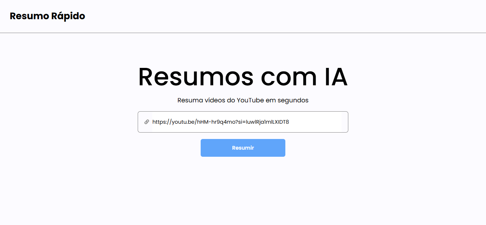
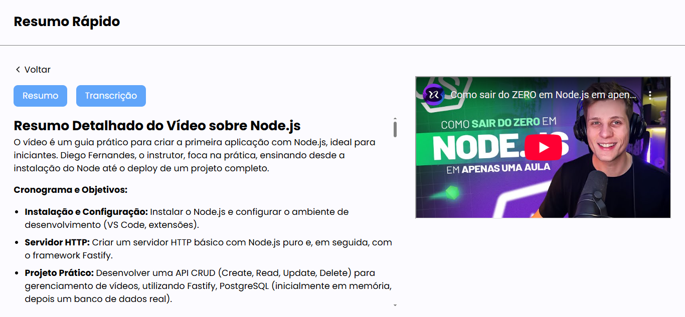
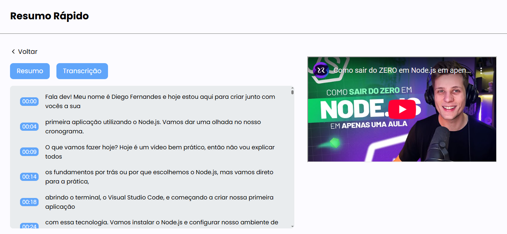

O projeto gera resumos de videos no youtube usando Inteligencia Artificial. Através do Gemine em conjunto com o pacote "youtube-transcript" responsavél por extrair a transcrição do video

#### HOME






### Inicializando projeto

Navegue até a parta "frontend" e execute o comando

```bash
npm install
```

*Faça o mesmo na pasta "backend"

### Executando projeto

Para executar tando o backend quanto o frontend usamos o comando

```bash
npm run dev
```

### .env client
Crie o arquivo .env na pasta "frontend" seguindo o modelo abaixo

```bash
VITE_BACKEND_BASE_URL = "A URL PADRÂO DO SEU BACKEND (http://localhost:8000)"
```

### .env backend
Crie o arquivo .env na pasta "backend" seguindo o modelo abaixo

```bash
GEMINI_API_KEY = "SUA CHAVE DE ACESSO DO GEMINE"
```


